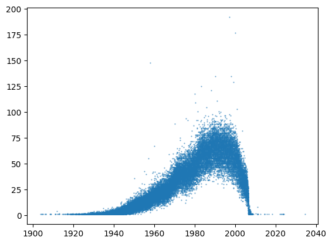
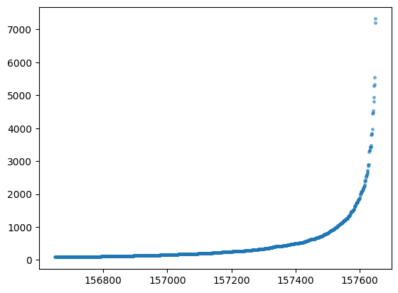
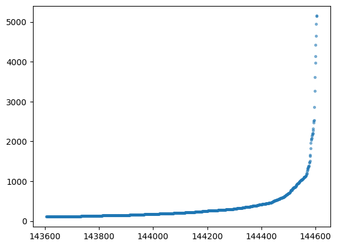
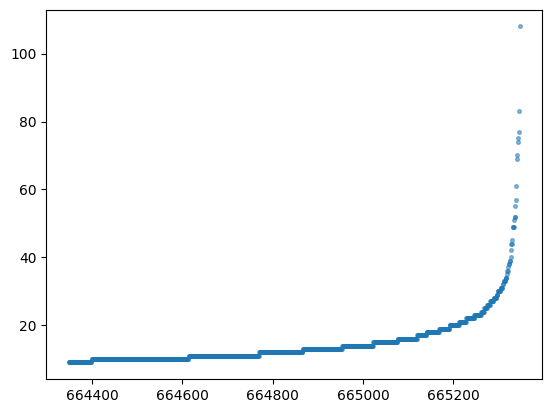
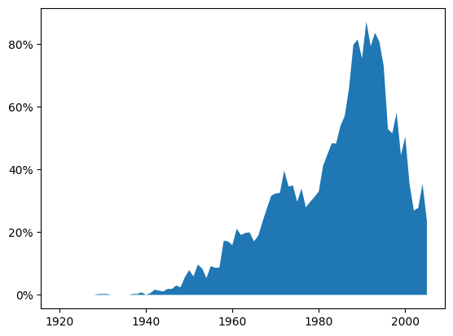

# Risk of Name+Birthday Collisions

This risk refers to the risk of false-positive matches when identifying people based on their given name, family name and their birthday. 

> I.e., how likely is it that there's some other `Oliver Lavers` out there who shares my birthday, and whose identity could be incorrectly merged with mine if that's the only evidence we use to determine identity?

There are a few ways to measure this risk. Each of them will give slightly different answers because each is based on slightly different assumptions. We'll look at one scenario which is quite generalised, and hopefully helps us build a reliable intuition around the risks.

First, let's look at the data individually...

## Birthday Distribution

 

> Fig 1.1: Number of records by birthday. Each dot here represents a birthday on the x-axis, and the number of records which list that birthday on the y-axis. 

This isn't too surprising - the people in our records have a relatively concentrated spread of birthdays, with a peak around 1990. It reflects the national age distribution relatively closely, with a sharp cut-off on birthdays more recent than ~2006, since those people aren't university-age yet.

## Given Name Distribution

 

> Fig 2.1: The count of the most common 1000 given names in our data, ordered from least common to most common.

This also isn't surprising - most names aren't very popular, but there are a few absolute standouts. Note the pattern of gaps at the high end of this curve - each international culture has a characteristic "fingerprint" of name popularity in the most common names - QUT's is a blend of several cultures!

```diff
- insert a subgraph here that calls out what those most popular names are!
```

## Family Name Distribution



> Fig 3.1: The count of the most common 1000 family names in our data, ordered from least common to most common.

Also nothing groundbreaking here, but note! The count of the most common given/family names is extremely high! What does this bode for full names?

## Full Name Distribution



> Fig 3.1: The count of the most common 1000 full names in our data, ordered from least common to most common. For the purposes of this graph, we have made the (conservative!) assumption that any pair of records with the same name and birthday relate to the same person, and have counted them as a single record.

Right, as we suspected, there are some full names that are extremely common (shared by over 100 individuals!), but the curve is significantly shallower than what we saw for given name or family name alone.

## HOLD UP

Wait a second... That last graph made the assumption that two records with the same name and birthday were duplicates of one another. 

> **Question**: Wasn't the whole point of this walkthrough to demonstrate that that is a dangerous assumption?
> 
> **Answer**: Yes. Thank you for paying attention.

We are going to perform a statistical trick. We are now going to try and **disprove** that assumption with statistics.

### Some Maths

Here's how this works. 

- There are a finite number of birthdays available in the last ~100 years.
- Your birthday within the year you are born is pretty much randomly assigned.

That means that for each birth year in our data, we can collect all the full names from that year, count the number of different birth**days** associated with that name, and imagine that each combination of name+birthday belongs to one person. Then we can ask ourselves, "given this number of people, what are the odds that they will each randomly have a unique birthday?"

Effectively, we are asking, "What are the odds that we were correct when we imagined that each name+birthday belongs to a single person?"

They might **not** have all had different birthdays. There might be two people in our data who share the same name and the same birthday - a collision. That would be hard to prove. But if we can prove that it's **unlikely** that we ended up with a scenario where there are no collisions, then that's proof that it's quite **likely** we have at least one collision!

> **Question:** Why are we calculating by year? Why not just calculate an overall value?
>
> **Answer:** We could! And in fact, we get pretty much the same answer. But remember that birthday curve from earlier? We know that a lot more people in our data are born in 1989 than are born in 1929. Calculating an overall value would assign equal probability to a collision in every year. By calculating the probability of a collision in each year, we get a more accurate answer, and then if we need to we can combine the yearly risk into an accurate overall risk calculation.

### Ok Let's Do It


> **Fig 4.1:** An area chart depicting yearly risk of a name+birthday collision from 1920-2006. 

Yikes. People born in the late 80's/early 90's have over an 80% chance of including at least one collision. That's too high.

If we calculate the overall odds by combining the probability from each year, we get a number so close to 100% that it makes little difference. Basically, we can be certain that we have at least one pair of individuals in our records who share a name and birthday.

How many such pairs to we have?

Hard to say, but odds of there being 10 or more such pairs are over 66%! And of course, every time a new student joins the university, we roll the dice again.